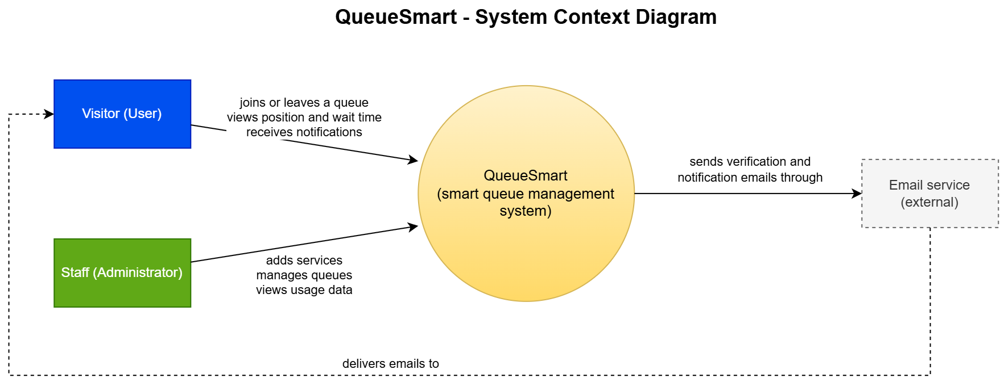

# Assignment 1: Initial Thoughts and System Design

QueueSmart - Smart Queue Management Application

Group 9: Mustafa Abudeiab, Hamere Dilu, Muhammad Puri, Lizzie Saucedo

## 1. Initial Thoughts

### Who are the main users of the system?
There are two main users of QueueSmart. Visitors are citizens who come to the office for a service such as renewing a driver's license or applying for a passport, and staff are the administrators responsible for running the office. Visitors mainly join queues and track their status, while staff manages the services offered, such as license renewals or ID applications, and keep the queue running smoothly.

### How will users and administrators interact with the application?
Visitors start by picking the service they need, such as renewing a driver's license or applying for a passport, then enter the queue either from their phone or a kiosk in the lobby and get a ticket confirming their spot. They can then track their position and estimated wait remotely instead of standing in line, and get notified once their turn is close so they know to head to the counter. Staff interact with the app through a management-facing dashboard, where they set up the services offered by the office, keep an eye on the queue and call the next visitor, and look at usage data to see how the office is doing overall.

### What are the most important features?
The most important features of QueueSmart are the virtual queue, real-time updates, and tools for visitors and staff. Visitors should be able to join a queue through their phone or a lobby kiosk, receive a digital and or printed ticket, view their position and estimated wait time, and receive notifications. Staff should have a live dashboard to manage services, counters, no-shows, transfers, and priority cases. Since we are developing a government office, the QueueSmart system should also provide clear and fair priority rules as well as privacy protections for personal information.

### What challenges do we anticipate?
The main challenges will be accurately estimating wait times, keeping queue information synchronized in real time, and handling unpredictable traffic. We also need to account for situations such as no-shows and users attempting to create multiple tickets. QueueSmart should also be designed with secure data practices, as this is a government office handling private information, as well as transactional queue management and simple staff workflows.

## 2. Development Methodology

### Which methodology will we follow?
Our team will use the Agile methodology. We will break the project into smaller tasks, work on them step by step while reviewing our progress.

### Why is this methodology appropriate for this project?
Agile makes sense for QueueSmart because our requirements and design might change as we go. It lets us fix things and improve our ideas based on feedback, instead of starting over from scratch. This flexibility is helpful for QueueSmart since parts like queue management, wait-time estimates, and notifications may need adjustments as we build them. Unlike Waterfall, where most things are planned upfront and changes later can be costly, Agile lets us make changes and improve things as we go.

### How will this approach help our team work across multiple assignments?
The project is split into several assignments, starting with the initial design, UI/UX, API, data design, and then the full project. Agile lets us build on what we've already done at each stage, split up tasks, and review the work before moving to the next stage. This keeps things organized and makes sure every assignment adds up to the final QueueSmart system.

## 3. High-Level Design / Architecture

### System Context Diagram

### How the major components interact
QueueSmart has two types of users. Visitors join a queue, see their position and estimated wait time, and get an email when their turn is near. Staff create and manage services, watch the queue, call the next visitor, and view usage data.
The QueueSmart box contains everything we build: login (visitors register themselves, while staff accounts are created by an existing administrator through an emailed invite.), services, the queue ordered by arrival time and priority, wait time estimates, and history. The only external system is the **Email Service**, which delivers our verification and notification emails.
A typical flow: a visitor logs in, joins a queue, and waits until QueueSmart emails them through the email service. They then walk to the counter and are served by a staff member. QueueSmart is a responsive web app, and notifications are emailonly.
## Team Contributions

| # | Group Member | What is your contribution? | Discussion Notes |
|---|---|---|---|
| 1 | Mustafa Abudeiab | | |
| 2 | Hamere Dilu | | |
| 3 | Muhammad Puri | | |
| 4 | Lizzie Saucedo | | |
